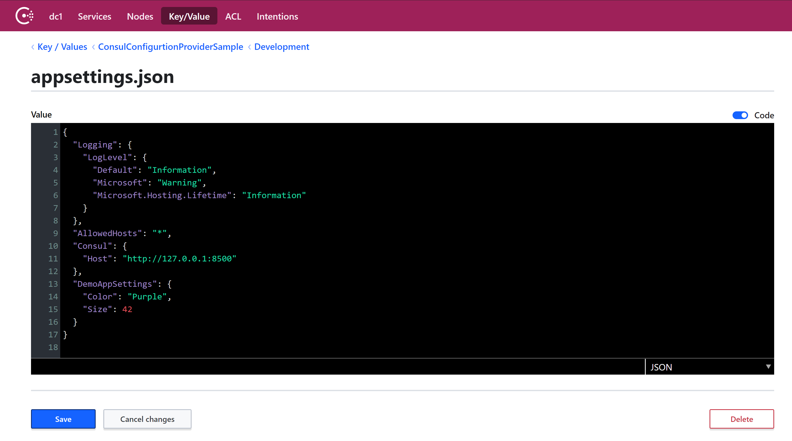

# ASP.NET Core, Consul Configurtion Provider
Configuring ASP.NET Core to use HashiCorp Consul

## Credits
[Dynamic ASP.NET Core Configurations With Consul KV](https://www.c-sharpcorner.com/article/dynamic-asp-net-core-configurations-with-consul-kv/)  
[Intro to Distributed Config with Consul on ASP.NET Core](https://www.dotnetcatch.com/2016/12/30/intro-to-distributed-config-with-consul-on-asp-net-core/)  
[The confusion of ASP.NET Configuration with environment variables](https://medium.com/@gparlakov/the-confusion-of-asp-net-configuration-with-environment-variables-c06c545ef732)  
[USING CONSUL FOR STORING THE CONFIGURATION IN ASP.NET CORE](https://www.natmarchand.fr/consul-configuration-aspnet-core/)

## Setup Consul

### Useing HELM Chart

#### From HashiCorp repo
[Helm install](https://www.consul.io/docs/platform/k8s/run.html)
[Helm variable](https://www.consul.io/docs/platform/k8s/helm.html)

#### From Bitnami repo
[Repo](https://bitnami.com/stack/consul/helm)  
```
# one time
helm repo add bitnami https://charts.bitnami.com/bitnami

# Create namespace (if not exists)
kubectl create namespace hashicorp

# install
helm install bitnami-consul bitnami/consul --namespace hashicorp

# Check status
helm status bitnami-consul -n hashicorp
kubectl get pods -n hashicorp
kubectl exec -it bitnami-consul-0 -n hashicorp -- consul members

# See consul nodes
kubectl exec -it bitnami-consul-0 -n hashicorp -- consul operator raft list-peers
```
##### Port mapping
navigate to: http://localhost:8500  
```
kubectl port-forward -n hashicorp svc/bitnami-consul-ui 8500:80
```

## Consul 
The following Consul configuration should work for the sample:  

